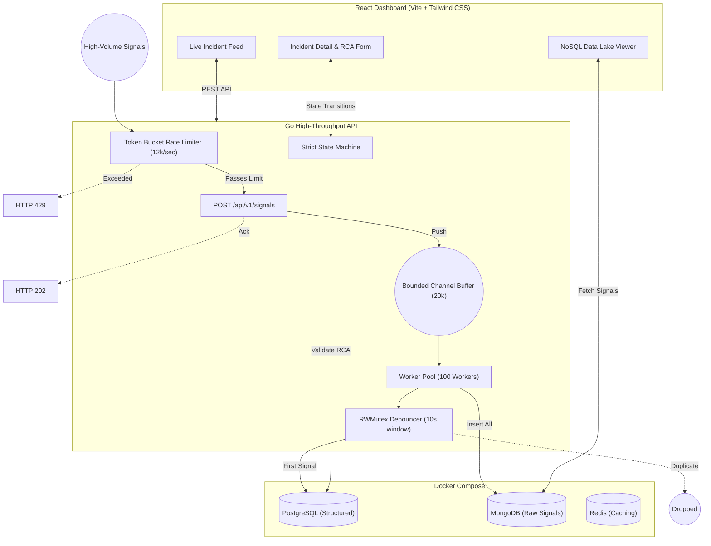

# High-Throughput Incident Management System

A robust, full-stack incident management application designed to ingest and process massive volumes of error signals per second. Built with a Go (Gin) backend, a React (Vite/Tailwind CSS) frontend, and a highly resilient dual-database architecture utilizing PostgreSQL and MongoDB.

## Architecture Diagram

The following diagram illustrates the flow of data through the system, highlighting the asynchronous ingestion pipeline, concurrency mechanisms, and the strict workflow state machine.



## Setup Instructions

The application relies on Docker Compose to orchestrate the database infrastructure seamlessly. Follow these steps to spin up the entire stack locally.

### 1. Initialize the Databases
From the root directory, start the PostgreSQL, MongoDB, and Redis containers. The provided initialization scripts (`init-postgres.sql` and `init-mongo.js`) will automatically provision the necessary relational schemas and time-series collections.
```bash
docker-compose up -d
```

### 2. Start the Go Backend
Open a terminal, navigate to the `backend` directory, and launch the Gin server. The backend will start on port `8080` and immediately begin logging real-time ingestion throughput metrics to the console.
```bash
cd backend
go mod tidy
go run main.go
```

### 3. Start the React Frontend
Open a new terminal session, navigate to the `frontend` directory, install the necessary dependencies, and start the Vite development server. The dashboard will be accessible at `http://localhost:5173`.
```bash
cd frontend
npm install
npm run dev
```

### 4. Run the Load Simulation (Optional)
To verify the system's resilience under extreme load, execute the provided bash script from the root directory. This will simulate a catastrophic failure (RDBMS outage and downstream MCP failure) by blasting the ingestion endpoint with 10,000 JSON payloads.
```bash
bash simulate_failure.sh
```

## Backpressure Handling Strategy

In distributed, high-throughput environments, a massive spike in error signals—such as during a cascading microservice failure—can quickly exhaust database connection pools and cause the incident management system itself to crash. To prevent this, the backend employs a rigorous, two-tier **Backpressure Strategy** relying on native Go concurrency primitives.

### Tier 1: Token Bucket Rate Limiting
The API ingress is fiercely protected by a global Token Bucket rate limiter (`golang.org/x/time/rate`).
- **Configuration**: The limiter is tuned to permit exactly **12,000 requests per second** with a burst capacity of **12,000**.
- **Behavior**: If the incoming payload velocity exceeds this threshold, the API immediately short-circuits and rejects the excess traffic with an `HTTP 429 Too Many Requests` status. This intentional load shedding sacrifices the ingestion of redundant signals to guarantee that the core dashboard APIs and state transitions remain highly available and responsive for operators.

### Tier 2: Bounded Go Channels (Asynchronous Ingestion)
To entirely decouple HTTP request latency from synchronous database disk I/O, the ingestion handler utilizes non-blocking bounded channels.
- **Buffer Capacity**: The `JobQueue` channel has a strict capacity of **20,000**.
- **Behavior**: When a valid signal passes the rate limiter, it is pushed onto this channel via a non-blocking `select` statement. The HTTP handler then *instantly* returns an `HTTP 202 Accepted` response before any database transactions are initiated.
- **Worker Pool**: A dedicated pool of **100 background goroutines** continually drains this channel. These workers apply the in-memory RWMutex debouncing logic (dropping duplicate signals within a 10-second window), insert the raw JSON payloads into MongoDB, and conditionally create `work_items` in PostgreSQL. 
- **Failsafe**: If the 20,000-capacity buffer becomes completely saturated (indicating that the databases are severely lagging behind the workers), the ingestion endpoint's `select` statement falls back to a `default` case, returning an `HTTP 503 Service Unavailable`. This critical failsafe prevents the Go runtime from endlessly allocating memory and crashing with an out-of-memory (OOM) panic.
